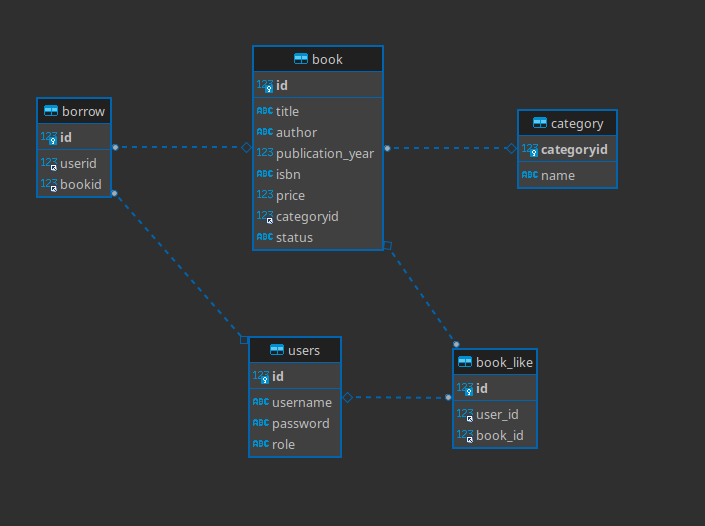

# Library
*My Library web application made with Java Spring Boot for the Back End -programming course.* 

Made using:
- Linux, Debian 12
- [Eclipse IDE for Enterprise Java and Web Developers 2023-06](https://www.eclipse.org/downloads/)
- Java version 17.0.8
- MariaDB (Ver 15.1 Distrib 10.11.3-MariaDB, for debian-linux-gnu (x86_64) using  EditLine wrapper)


The application uses MariaDB, which was running on localhost, when tested.    
Relationships:
```bash
OneToOne
OneToMany
ManyToMany
```

Database:    


The application features the following functionalities:

-   Usage requires registering.
	- Registered user needs admin approval to use it.
	- Books can be sorted in basic booklist view.
- Roles:
	- Temp:
		- Only sees "Waiting for approval".
	- User:
		- Borrow books (and return).
		- Like books.
			- See who has liked the book.
			- View own liked books in separate view.
	- Admin (Everything what User does, plus):
		- Add, edit and delete books
		- Add, edit and delete categories
		- Delete users and change user roles.
		- See who has borrowed a book.
		- Mark books as returned, even if user hasnt return them.
- User can like multiple books.
- Book can have multiple likes.
- User can borrow multiple books.
- Book can have only one borrower.
- Some views are accessible based on role.
- Books cant be deleted if not returned.
- Books can be deleted even if they have "likes"
- JUnit testing. (Uses separate properties and schema = separate database to not interfere with the production one)

**REST:
- API endpoint is accessedonly by admin and contains highly experimental/deprecated methods, for example http basic authentication and disabling cross site request forgery.
	- This was done due to limited skills and schedule.**

The UI and the code:

- Very minimal, simple dark UI, using [bootstrap.min.css](https://getbootstrap.com/docs/4.0/getting-started/download/)
- Conditional statements are used to display stuff, based on the status etc.
	- For example Borrow/Return, Like/Unlike.

The project was intentionally designed with very simple UI, keeping the focus on the back end side.
MariaDB was chosen for simplicity and previous experience.
Database address and password are/were stored in IDE:s environment variable.   
- (Needed in application.properties. Separate properties and schema for JUnit testings)

**Simplified structure**
<pre>
├── pom.xml
├── src
│   ├── main
│   │   ├── java
│   │   │   └── halonen
│   │   │       └── library
│   │   │           ├── domain
│   │   │           │   ├── Book.java
│   │   │           │   ├── BookRepository.java
│   │   │           │   ├── Borrow.java
│   │   │           │   ├── BorrowRepository.java
│   │   │           │   ├── Category.java
│   │   │           │   ├── CategoryRepository.java
│   │   │           │   ├── Like.java
│   │   │           │   ├── LikeRepository.java
│   │   │           │   ├── Message.java
│   │   │           │   ├── SignUpForm.java
│   │   │           │   ├── User.java
│   │   │           │   └── UserRepository.java
│   │   │           ├── LibraryApplication.java
│   │   │           ├── service
│   │   │           │   ├── BookStatus.java
│   │   │           │   ├── LikeService.java
│   │   │           │   ├── MyAuthenticationSuccessHandler.java
│   │   │           │   └── UserDetailService.java
│   │   │           └── web
│   │   │               ├── AdminController.java
│   │   │               ├── BookController.java
│   │   │               ├── BookRestController.java
│   │   │               ├── BorrowController.java
│   │   │               ├── CategoryController.java
│   │   │               ├── CustomErrorController.java
│   │   │               ├── LikeController.java
│   │   │               ├── MySecurityConfig.java
│   │   │               └── UserController.java
│   │   └── resources
│   │       ├── application.properties
│   │       ├── schema.sql
│   │       ├── static
│   │       │   ├── css
│   │       │   │   └── bootstrap.min.css
│   │       │   └── js
│   │       │       └── newCategory.js
│   │       └── templates
│   │           ├── addbook.html
│   │           ├── addcategory.html
│   │           ├── admin.html
│   │           ├── approval.html
│   │           ├── booklist.html
│   │           ├── editbook.html
│   │           ├── error.html
│   │           ├── likedbooks.html
│   │           ├── login.html
│   │           └── signup.html
│   └── test
│       ├── java
│       │   └── halonen
│       │       └── library
│       │           ├── BookRepositoryTests.java
│       │           ├── CategoryRepositoryTests.java
│       │           ├── LibraryApplicationTests.java
│       │           ├── LibraryRestTests.java
│       │           └── UserRepositoryTests.java
│       └── resources
│           ├── application.properties
│           └── schema-test.sql
</pre>

### Instructions
- Have MariaDB and Eclipse installed and setup.
- Create databases for production and JUnit testing
- Assign environment variables or edit application.properties for both main and testing.
- Use schema.sql to setup the database
- Update dependencies and run!
